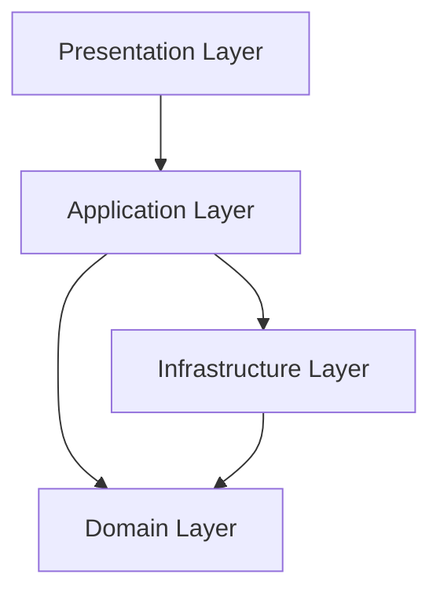

<div align="center">

# WalletWise

[](https://github.com/yourusername/wallet-wise/stargazers)
[](https://github.com/yourusername/wallet-wise/issues)
[](https://choosealicense.com/licenses/mit/)
[](https://linkedin.com/in/yourusername)

Your Smart Financial Management Solution

[Explore Demo](https://demo-link.com) · [Report Bug](https://github.com/yourusername/wallet-wise/issues) · [Request Feature](https://github.com/yourusername/wallet-wise/issues)


</div>

## 🌟 Overview

WalletWise is a comprehensive financial management application built with Spring Boot, implementing Clean Architecture principles. It helps users track expenses, manage savings, and generate detailed financial reports.

### Built With
<div align="center">

[](https://spring.io/projects/spring-boot)
[](https://www.java.com/)
[](https://www.docker.com/)
[](https://www.postgresql.org/)
[](https://jwt.io/)
[](https://projectlombok.org/)

</div>

## ✨ Features

### Core Functionality
- 📊 **Expense Tracking**
  - Real-time transaction monitoring
  - Category-based organization
  - Custom tags and notes

- 💰 **Savings Management**
  - Goal setting and tracking
  - Auto-save rules
  - Progress visualization

- 📈 **Financial Reports**
  - Custom date range analysis
  - Category-wise breakdown
  - Export functionality (PDF, CSV)

### Technical Features
- 🔐 JWT Authentication
- 🔄 RESTful API
- 📱 Mobile-ready endpoints
- 🐳 Docker containerization
- 📝 Swagger documentation

## 🏗 Architecture

WalletWise implements Clean Architecture principles, ensuring separation of concerns and maintainable code:



### Project Structure
```
wallet-wise/
├── 📂 domain/
│   ├── entities/
│   ├── repositories/
│   └── services/
├── 📂 application/
│   ├── usecases/
│   └── ports/
├── 📂 infrastructure/
│   ├── persistence/
│   ├── security/
│   └── config/
└── 📂 interfaces/
    ├── rest/
    ├── dto/
    └── controllers/
```

## 🚀 Getting Started

### Prerequisites

- Java 17 or higher
- Docker & Docker Compose
- Maven 3.8+
- PostgreSQL 13+

### Installation

1. Clone the repository
```bash
git clone https://github.com/yourusername/wallet-wise.git
```

2. Configure environment variables
```bash
cp .env.example .env
# Edit .env with your configuration
```

3. Build and run with Docker
```bash
docker-compose up -d
```

### API Documentation

Access Swagger UI at `http://localhost:8080/swagger-ui.html`


## 🧪 Testing

```bash
# Unit tests
mvn test

# Integration tests
mvn verify

# Coverage report
mvn jacoco:report
```

## 📊 Performance

| Operation | Response Time | Throughput |
|-----------|--------------|------------|
| GET /transactions | <100ms | 1000 req/s |
| POST /transactions | <200ms | 500 req/s |
| GET /reports | <300ms | 100 req/s |

## 🛠 Configuration

### Application Properties
```yaml
spring:
  application:
    name: wallet-wise
  datasource:
    url: jdbc:postgresql://${DB_HOST}:${DB_PORT}/${DB_NAME}
    username: ${DB_USER}
    password: ${DB_PASSWORD}
```

### Security Configuration
```yaml
security:
  jwt:
    secret: ${JWT_SECRET}
    expiration: 86400000 # 24 hours
```

## 🤝 Contributing

We welcome contributions! Please follow these steps:

1. Fork the repository
2. Create your feature branch (`git checkout -b feature/AmazingFeature`)
3. Commit your changes (`git commit -m 'Add AmazingFeature'`)
4. Push to the branch (`git push origin feature/AmazingFeature`)
5. Open a Pull Request

## 📝 License

Distributed under the MIT License. See `LICENSE` for more information.

## 📬 Contact

Your Name - [@yourtwitter](https://twitter.com/yourtwitter) - email@example.com

Project Link: [https://github.com/yourusername/wallet-wise](https://github.com/yourusername/wallet-wise)

---
<div align="center">

Made with ❤️ by [Your Name](https://github.com/yourusername)

⭐ Star us on GitHub — it motivates us a lot!

</div>